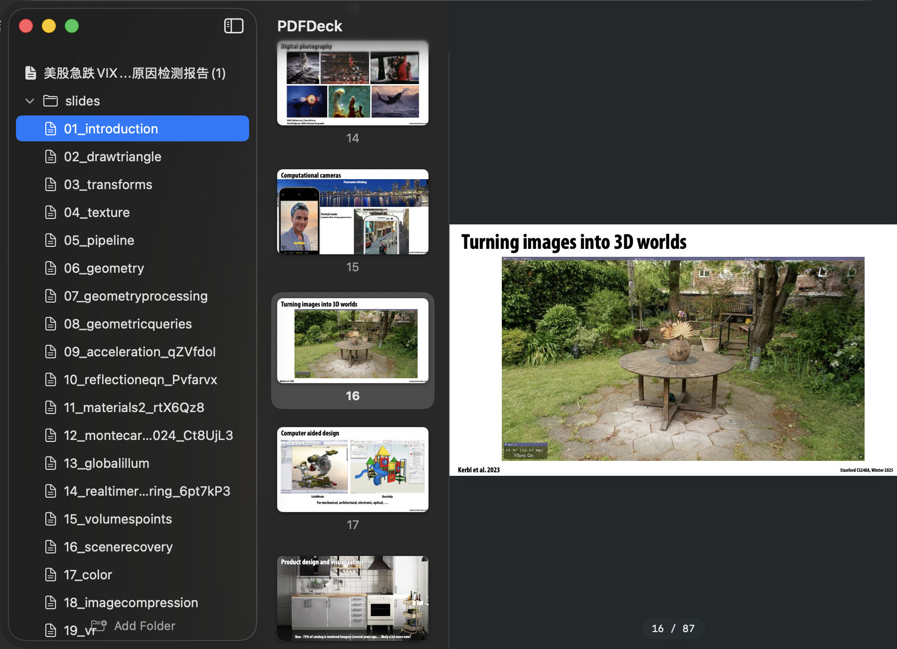

# PDFDeck

A fast, native macOS viewer for browsing **many large PDFs** across folders. SwiftUI + PDFKit, display-only (no annotation/editing) — built for quickly flipping pages and switching files from the keyboard.



## Why it stays fast

- `PDFDocument` memory-maps files; only the **current** document is resident. Keep hundreds of PDFs in the list — only one is parsed at a time.
- Single-page rendering; thumbnails are lazy, cached, and byte-budgeted. The thumbnail cache is dropped on document switch, so idle memory stays low (~250–300 MB) and never accumulates across documents.

## Features

- **Collapsible folder tree** sidebar. Import whole folders (scanned recursively); folders and custom (display-only) names persist across launches.
- **Rounded-card page thumbnails** with native focused/unfocused selection.
- **Open any PDF directly** — registers itself as the default PDF viewer. Externally-opened PDFs appear at the **top level**, alongside folders.
- Remembers the **last page per file**.

## Keyboard (focus-driven: sidebar tree ⇄ slides column)

**Sidebar focused**

| Key | Action |
|-----|--------|
| ↑ / ↓ | move through the tree (folder headers + files) |
| ← | file: collapse its folder · folder: collapse |
| → | file: hand focus to slides · folder: expand, or enter first file |

**Slides focused**

| Key | Action |
|-----|--------|
| ↑ / ↓ | previous / next page |
| ← | return focus to the sidebar |

Selection styling matches macOS: the focused zone's selection is an accent fill; the unfocused zone's is grey.

**Zoom** — trackpad pinch, or ⌘+ / ⌘− / ⌘0 (fit) / ⌘1 (actual size). Dense pages (e.g. newspaper layouts) become readable; zoom resets to fit when you switch files.

## Build & install

Requires the Xcode toolchain, macOS 14+.

```sh
./build_app.sh                 # builds PDFDeck.app (release) with the app icon
open PDFDeck.app
cp -R PDFDeck.app /Applications/   # install
```

## Regenerate the app icon

```sh
swift make_icon.swift logo_src.png icon_master.png   # logo → 1024 squircle master
# build_app.sh embeds AppIcon.icns into the bundle
```

## Notes

- Settings (folders, display names, per-file page, externally-opened files) live in `UserDefaults`, domain `local.pdfdeck`.
- The app is ad-hoc signed; it's a local build, not notarized.
